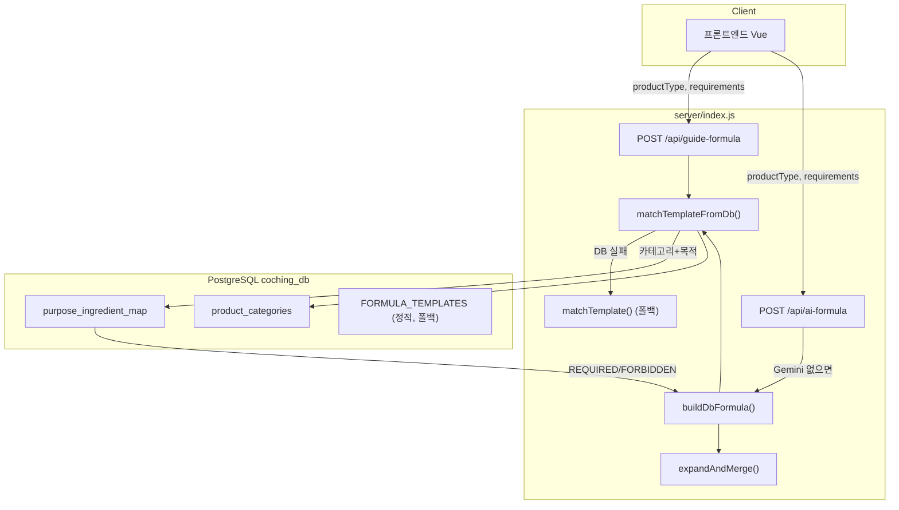
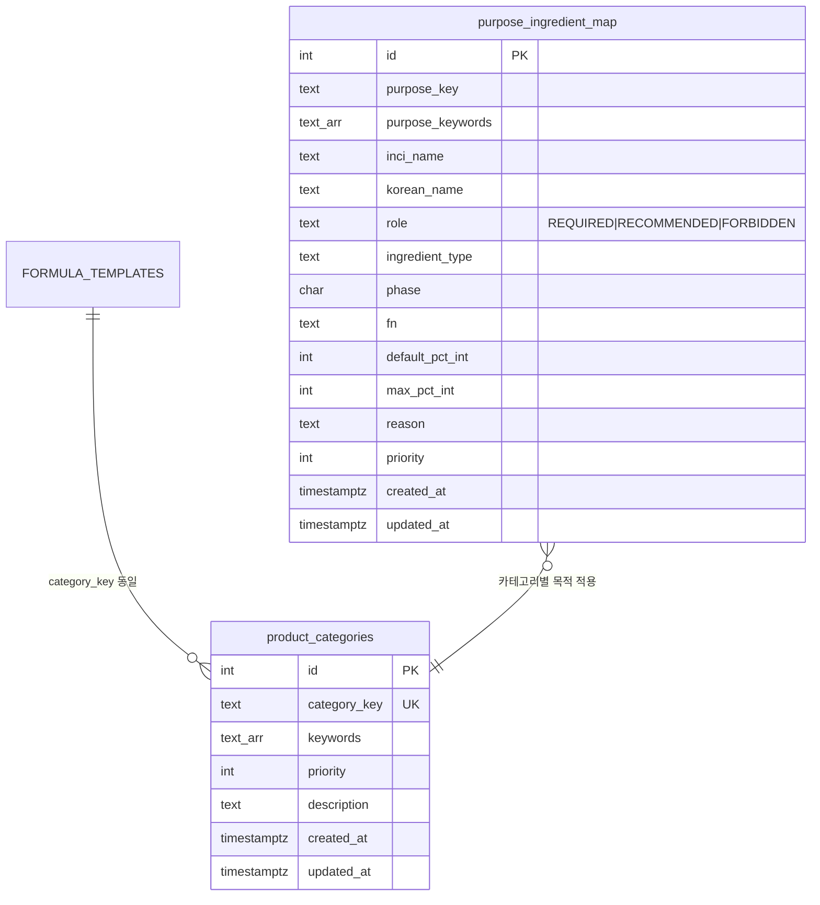
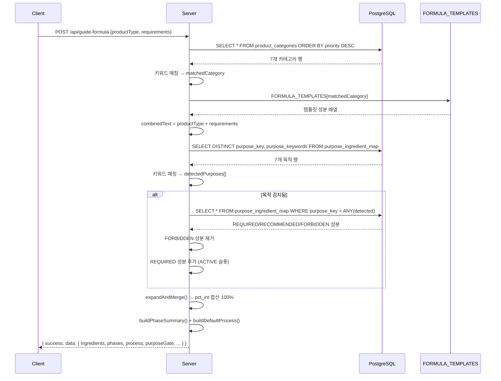

# Purpose Gate 시스템 — 상세 기술 설계

> 작성일: 2026-03-13
> 대상: `E:\MyLab-Studio\server\index.js`
> 목적: 제품 목적(보습, 미백, 진정 등)에 따라 활성성분을 동적으로 교체/배제하는 DB 기반 처방 가이드 시스템

---

## 1. 컨텍스트 다이어그램



---

## 2. 설계 대안 분석

### 대안 A: 2-테이블 분리 (채택)

| 항목 | 설명 |
|------|------|
| 구조 | `product_categories` (카테고리 키워드) + `purpose_ingredient_map` (목적별 성분) |
| 장점 | 카테고리와 목적이 독립적 → 7 x 7 = 49가지 조합 가능. 카테고리/목적 각각 독립 확장 |
| 단점 | JOIN 또는 2회 쿼리 필요 |
| 적합성 | 현재 규모(7카테고리, 7+목적)에서 2회 쿼리 오버헤드 무시 가능. 확장성 우수 |

### 대안 B: 단일 테이블 (비채택)

| 항목 | 설명 |
|------|------|
| 구조 | `formula_purpose_config` 에 카테고리+목적+성분을 JSONB 컬럼으로 통합 |
| 장점 | 쿼리 1회 |
| 단점 | JSONB 내부 검색 비용, 데이터 중복(같은 성분이 여러 카테고리에 반복), 스키마 변경 어려움 |

**결론**: 대안 A 채택. 정규화된 2-테이블이 유지보수와 확장 모두 유리하다.

---

## 3. DB 스키마

### 3.1 product_categories

기존 `matchTemplate()`의 하드코딩된 키워드 매칭을 DB화한다.

```sql
CREATE TABLE IF NOT EXISTS product_categories (
    id          SERIAL PRIMARY KEY,
    category_key TEXT NOT NULL UNIQUE,       -- '크림', '로션', '토너' 등 (FORMULA_TEMPLATES 키와 동일)
    keywords    TEXT[] NOT NULL,             -- 매칭 키워드 배열
    priority    INT NOT NULL DEFAULT 0,      -- 높을수록 우선 매칭 (선크림=100 > 크림=10)
    description TEXT,                        -- 카테고리 설명
    created_at  TIMESTAMPTZ DEFAULT NOW(),
    updated_at  TIMESTAMPTZ DEFAULT NOW()
);

CREATE INDEX IF NOT EXISTS idx_pc_priority ON product_categories(priority DESC);
```

### 3.2 purpose_ingredient_map

목적별 성분 매핑. 하나의 목적에 REQUIRED/RECOMMENDED/FORBIDDEN 성분을 등록한다.

```sql
CREATE TABLE IF NOT EXISTS purpose_ingredient_map (
    id              SERIAL PRIMARY KEY,
    purpose_key     TEXT NOT NULL,            -- '보습', '미백', '진정' 등
    purpose_keywords TEXT[] NOT NULL,         -- 목적 감지 키워드 ['보습', 'moisturizing', 'hydrating']
    inci_name       TEXT NOT NULL,            -- INCI명 (ingredient_master 참조)
    korean_name     TEXT,                     -- 한국명
    role            TEXT NOT NULL CHECK (role IN ('REQUIRED', 'RECOMMENDED', 'FORBIDDEN')),
    ingredient_type TEXT,                     -- 'ACTIVE', 'HUMECTANT', 'UV_FILTER' 등
    phase           CHAR(1) DEFAULT 'C',      -- 기본 Phase (A/B/C/D)
    fn              TEXT,                     -- 기능 설명
    default_pct_int INT,                      -- 기본 배합비 (정수, x100)
    max_pct_int     INT,                      -- 규제 최대 배합비 (정수, x100)
    reason          TEXT,                     -- FORBIDDEN인 경우 배제 사유
    priority        INT DEFAULT 0,            -- 같은 role 내 우선순위
    created_at      TIMESTAMPTZ DEFAULT NOW(),
    updated_at      TIMESTAMPTZ DEFAULT NOW(),
    UNIQUE(purpose_key, inci_name, role)
);

CREATE INDEX IF NOT EXISTS idx_pim_purpose ON purpose_ingredient_map(purpose_key);
CREATE INDEX IF NOT EXISTS idx_pim_role ON purpose_ingredient_map(role);
CREATE INDEX IF NOT EXISTS idx_pim_inci ON purpose_ingredient_map(inci_name);
```

### 3.3 ERD



---

## 4. 시드 데이터

### 4.1 product_categories (7건)

```sql
INSERT INTO product_categories (category_key, keywords, priority, description) VALUES
('선크림', ARRAY['선크림','썬크림','자외선','sun','spf','uv','sunscreen','sunblock'], 100, '자외선 차단 제품'),
('클렌징', ARRAY['클렌','폼','워시','클렌징','cleanser','cleansing','foam','wash'], 90, '세정 제품'),
('샴푸',   ARRAY['샴푸','shampoo','헤어워시'], 80, '두발 세정 제품'),
('세럼',   ARRAY['세럼','에센스','앰플','serum','essence','ampoule'], 70, '고농축 에센스/세럼'),
('토너',   ARRAY['토너','스킨','미스트','toner','skin','mist'], 60, '토너/스킨/미스트'),
('로션',   ARRAY['로션','에멀','바디','lotion','emulsion','body'], 50, '로션/에멀전'),
('크림',   ARRAY['크림','cream','moisturizer','모이스처라이저'], 10, '크림 (기본 폴백)')
ON CONFLICT (category_key) DO NOTHING;
```

### 4.2 purpose_ingredient_map (7개 목적 x 성분들)

```sql
-- ========================================
-- 목적 1: 보습
-- ========================================
INSERT INTO purpose_ingredient_map (purpose_key, purpose_keywords, inci_name, korean_name, role, ingredient_type, phase, fn, default_pct_int, max_pct_int, reason, priority) VALUES
-- REQUIRED (3건)
('보습', ARRAY['보습','moisturizing','hydrating','hydration','수분'], 'Sodium Hyaluronate', '히알루론산', 'REQUIRED', 'HUMECTANT', 'C', '고분자 보습제 — 수분 보유력 극대화', 10, 200, NULL, 100),
('보습', ARRAY['보습','moisturizing','hydrating','hydration','수분'], 'Glycerin', '글리세린', 'REQUIRED', 'HUMECTANT', 'A', '다가알코올 보습제', 500, 1000, NULL, 90),
('보습', ARRAY['보습','moisturizing','hydrating','hydration','수분'], 'Panthenol', '판테놀', 'REQUIRED', 'ACTIVE', 'C', '프로비타민 B5 — 피부 장벽 강화 + 보습', 100, 500, NULL, 80),
-- RECOMMENDED (3건)
('보습', ARRAY['보습','moisturizing','hydrating','hydration','수분'], 'Squalane', '스쿠알란', 'RECOMMENDED', 'EMOLLIENT', 'B', '피부 유사 오일 — 수분 증발 방지', 300, 1000, NULL, 70),
('보습', ARRAY['보습','moisturizing','hydrating','hydration','수분'], 'Ceramide NP', '세라마이드NP', 'RECOMMENDED', 'ACTIVE', 'C', '피부 장벽 리피드 보충', 10, 100, NULL, 60),
('보습', ARRAY['보습','moisturizing','hydrating','hydration','수분'], 'Betaine', '베타인', 'RECOMMENDED', 'HUMECTANT', 'A', '천연 유래 보습제 — 삼투압 조절', 200, 500, NULL, 50),
-- FORBIDDEN (2건)
('보습', ARRAY['보습','moisturizing','hydrating','hydration','수분'], 'Alcohol Denat.', '변성알코올', 'FORBIDDEN', 'SOLVENT', NULL, NULL, NULL, NULL, '고농도 알코올은 피부 건조/장벽 손상 유발 — 보습 목적에 상충', 0),
('보습', ARRAY['보습','moisturizing','hydrating','hydration','수분'], 'Sodium Lauryl Sulfate', '소듐라우릴설페이트', 'FORBIDDEN', 'SURFACTANT', NULL, NULL, NULL, NULL, '강한 탈지력으로 피부 보습막 제거 — 보습 처방에 부적합', 0),

-- ========================================
-- 목적 2: 미백/브라이트닝
-- ========================================
-- REQUIRED (4건)
('미백', ARRAY['미백','브라이트닝','brightening','whitening','톤업','tone-up','기미','잡티'], 'Niacinamide', '나이아신아마이드', 'REQUIRED', 'ACTIVE', 'C', '멜라닌 전이 억제 — 기능성 미백 고시 원료', 300, 500, NULL, 100),
('미백', ARRAY['미백','브라이트닝','brightening','whitening','톤업','tone-up','기미','잡티'], 'Alpha-Arbutin', '알파알부틴', 'REQUIRED', 'ACTIVE', 'C', '티로시나아제 억제제 — 멜라닌 생성 차단', 200, 500, NULL, 90),
('미백', ARRAY['미백','브라이트닝','brightening','whitening','톤업','tone-up','기미','잡티'], 'Ascorbyl Glucoside', '아스코빌글루코사이드', 'REQUIRED', 'ACTIVE', 'C', '안정형 비타민C 유도체 — 항산화+미백', 200, 300, NULL, 80),
('미백', ARRAY['미백','브라이트닝','brightening','whitening','톤업','tone-up','기미','잡티'], 'Tranexamic Acid', '트라넥사믹애씨드', 'REQUIRED', 'ACTIVE', 'C', '플라스민 억제 — 색소침착 예방', 200, 300, NULL, 70),
-- RECOMMENDED (2건)
('미백', ARRAY['미백','브라이트닝','brightening','whitening','톤업','tone-up','기미','잡티'], 'Glutathione', '글루타치온', 'RECOMMENDED', 'ACTIVE', 'C', '항산화 + 멜라닌 환원', 10, 100, NULL, 60),
('미백', ARRAY['미백','브라이트닝','brightening','whitening','톤업','tone-up','기미','잡티'], 'Licorice Root Extract', '감초뿌리추출물', 'RECOMMENDED', 'ACTIVE', 'C', '글라브리딘 함유 — 미백 보조', 50, 200, NULL, 50),
-- FORBIDDEN (1건)
('미백', ARRAY['미백','브라이트닝','brightening','whitening','톤업','tone-up','기미','잡티'], 'Hydroquinone', '하이드로퀴논', 'FORBIDDEN', 'ACTIVE', NULL, NULL, NULL, NULL, '한국 화장품법 사용 금지 원료 (의약품 전용)', 0),

-- ========================================
-- 목적 3: 진정
-- ========================================
-- REQUIRED (4건)
('진정', ARRAY['진정','soothing','calming','민감','sensitive','자극완화','홍조','redness'], 'Centella Asiatica Extract', '병풀추출물', 'REQUIRED', 'ACTIVE', 'C', 'CICA — 마데카소사이드/아시아티코사이드 함유 진정', 100, 500, NULL, 100),
('진정', ARRAY['진정','soothing','calming','민감','sensitive','자극완화','홍조','redness'], 'Madecassoside', '마데카소사이드', 'REQUIRED', 'ACTIVE', 'C', '병풀 유래 트리테르펜 — 피부 재생/진정', 10, 100, NULL, 90),
('진정', ARRAY['진정','soothing','calming','민감','sensitive','자극완화','홍조','redness'], 'Allantoin', '알란토인', 'REQUIRED', 'ACTIVE', 'C', '세포 재생 촉진 + 항자극', 10, 50, NULL, 80),
('진정', ARRAY['진정','soothing','calming','민감','sensitive','자극완화','홍조','redness'], 'Bisabolol', '비사볼올', 'REQUIRED', 'ACTIVE', 'C', '카모마일 유래 항염/진정', 10, 100, NULL, 70),
-- RECOMMENDED (2건)
('진정', ARRAY['진정','soothing','calming','민감','sensitive','자극완화','홍조','redness'], 'Panthenol', '판테놀', 'RECOMMENDED', 'ACTIVE', 'C', '프로비타민 B5 — 피부 장벽 회복 보조', 100, 500, NULL, 60),
('진정', ARRAY['진정','soothing','calming','민감','sensitive','자극완화','홍조','redness'], 'Beta-Glucan', '베타글루칸', 'RECOMMENDED', 'ACTIVE', 'C', '면역 조절 + 진정', 10, 100, NULL, 50),
-- FORBIDDEN (2건)
('진정', ARRAY['진정','soothing','calming','민감','sensitive','자극완화','홍조','redness'], 'Alcohol Denat.', '변성알코올', 'FORBIDDEN', 'SOLVENT', NULL, NULL, NULL, NULL, '진정 목적 피부에 알코올 자극 — 홍조/건조 악화', 0),
('진정', ARRAY['진정','soothing','calming','민감','sensitive','자극완화','홍조','redness'], 'Menthol', '멘톨', 'FORBIDDEN', 'ACTIVE', NULL, NULL, NULL, NULL, '냉감 자극 — 민감/진정 처방에 부적합', 0),

-- ========================================
-- 목적 4: 주름개선/안티에이징
-- ========================================
-- REQUIRED (4건)
('안티에이징', ARRAY['주름','안티에이징','anti-aging','antiaging','탄력','firming','리프팅','lifting','노화','aging'], 'Adenosine', '아데노신', 'REQUIRED', 'ACTIVE', 'C', '기능성 주름개선 고시 원료 — 콜라겐 합성 촉진', 40, 100, NULL, 100),
('안티에이징', ARRAY['주름','안티에이징','anti-aging','antiaging','탄력','firming','리프팅','lifting','노화','aging'], 'Retinol', '레티놀', 'REQUIRED', 'ACTIVE', 'C', '비타민A — 세포 턴오버 촉진/주름 개선', 10, 100, NULL, 90),
('안티에이징', ARRAY['주름','안티에이징','anti-aging','antiaging','탄력','firming','리프팅','lifting','노화','aging'], 'Peptide Complex', '펩타이드복합체', 'REQUIRED', 'ACTIVE', 'C', '신호전달 펩타이드 — 콜라겐/엘라스틴 생성 유도', 50, 200, NULL, 80),
('안티에이징', ARRAY['주름','안티에이징','anti-aging','antiaging','탄력','firming','리프팅','lifting','노화','aging'], 'Niacinamide', '나이아신아마이드', 'REQUIRED', 'ACTIVE', 'C', '장벽 강화 + 주름 개선 보조', 300, 500, NULL, 70),
-- RECOMMENDED (2건)
('안티에이징', ARRAY['주름','안티에이징','anti-aging','antiaging','탄력','firming','리프팅','lifting','노화','aging'], 'Tocopheryl Acetate', '토코페릴아세테이트', 'RECOMMENDED', 'ANTIOXIDANT', 'D', '항산화 — 산화 스트레스 방지', 30, 200, NULL, 60),
('안티에이징', ARRAY['주름','안티에이징','anti-aging','antiaging','탄력','firming','리프팅','lifting','노화','aging'], 'Ceramide NP', '세라마이드NP', 'RECOMMENDED', 'ACTIVE', 'C', '피부 장벽 리피드 — 탄력 유지 보조', 10, 100, NULL, 50),
-- FORBIDDEN (1건)
('안티에이징', ARRAY['주름','안티에이징','anti-aging','antiaging','탄력','firming','리프팅','lifting','노화','aging'], 'Benzoyl Peroxide', '벤조일퍼옥사이드', 'FORBIDDEN', 'ACTIVE', NULL, NULL, NULL, NULL, '레티놀을 산화 분해 — 안티에이징 핵심 원료와 상충', 0),

-- ========================================
-- 목적 5: 자외선차단
-- ========================================
-- REQUIRED (3건)
('자외선차단', ARRAY['자외선','차단','uv','spf','pa','sun protection','선케어'], 'Zinc Oxide', '징크옥사이드', 'REQUIRED', 'UV_FILTER', 'C', '무기 자차 — UVA+UVB 광대역 차단', 1500, 2500, NULL, 100),
('자외선차단', ARRAY['자외선','차단','uv','spf','pa','sun protection','선케어'], 'Titanium Dioxide', '티타늄디옥사이드', 'REQUIRED', 'UV_FILTER', 'C', '무기 자차 — UVB+UVA2 차단', 700, 2500, NULL, 90),
('자외선차단', ARRAY['자외선','차단','uv','spf','pa','sun protection','선케어'], 'Cyclopentasiloxane', '사이클로펜타실록세인', 'REQUIRED', 'EMOLLIENT', 'B', '실리콘 용매 — 자차 분산/발림성', 1200, 2000, NULL, 80),
-- RECOMMENDED (2건)
('자외선차단', ARRAY['자외선','차단','uv','spf','pa','sun protection','선케어'], 'Tocopheryl Acetate', '토코페릴아세테이트', 'RECOMMENDED', 'ANTIOXIDANT', 'D', '항산화 — UV 유발 활성산소 중화', 30, 200, NULL, 60),
('자외선차단', ARRAY['자외선','차단','uv','spf','pa','sun protection','선케어'], 'Bisabolol', '비사볼올', 'RECOMMENDED', 'ACTIVE', 'D', '자외선 후 진정/항자극', 10, 100, NULL, 50),
-- FORBIDDEN (2건)
('자외선차단', ARRAY['자외선','차단','uv','spf','pa','sun protection','선케어'], 'AHA (Glycolic Acid)', '글리콜릭애씨드', 'FORBIDDEN', 'ACTIVE', NULL, NULL, NULL, NULL, '자차 제형 pH를 산성으로 이동 → ZnO 용출 위험', 0),
('자외선차단', ARRAY['자외선','차단','uv','spf','pa','sun protection','선케어'], 'Retinol', '레티놀', 'FORBIDDEN', 'ACTIVE', NULL, NULL, NULL, NULL, '자외선 노출 시 레티놀 광분해 + 광과민 유발', 0),

-- ========================================
-- 목적 6: 세정
-- ========================================
-- REQUIRED (3건)
('세정', ARRAY['세정','클렌징','cleansing','폼','foam','워시','wash','세안'], 'Cocamidopropyl Betaine', '코카미도프로필베타인', 'REQUIRED', 'SURFACTANT', 'A', '양쪽성 계면활성제 — 마일드 세정', 800, 1500, NULL, 100),
('세정', ARRAY['세정','클렌징','cleansing','폼','foam','워시','wash','세안'], 'Sodium Cocoyl Isethionate', '소듐코코일이세치오네이트', 'REQUIRED', 'SURFACTANT', 'A', '마일드 음이온 계면활성제', 300, 800, NULL, 90),
('세정', ARRAY['세정','클렌징','cleansing','폼','foam','워시','wash','세안'], 'Glycerin', '글리세린', 'REQUIRED', 'HUMECTANT', 'A', '세정 후 보습 유지', 300, 500, NULL, 80),
-- RECOMMENDED (2건)
('세정', ARRAY['세정','클렌징','cleansing','폼','foam','워시','wash','세안'], 'Centella Asiatica Extract', '병풀추출물', 'RECOMMENDED', 'ACTIVE', 'C', '세정 후 진정', 10, 100, NULL, 60),
('세정', ARRAY['세정','클렌징','cleansing','폼','foam','워시','wash','세안'], 'Allantoin', '알란토인', 'RECOMMENDED', 'ACTIVE', 'C', '세정 후 피부 보호', 10, 50, NULL, 50),
-- FORBIDDEN (1건)
('세정', ARRAY['세정','클렌징','cleansing','폼','foam','워시','wash','세안'], 'Retinol', '레티놀', 'FORBIDDEN', 'ACTIVE', NULL, NULL, NULL, NULL, '세정 제형에서는 접촉 시간이 짧아 효과 없고 자극만 유발', 0),

-- ========================================
-- 목적 7: 모발관리
-- ========================================
-- REQUIRED (3건)
('모발관리', ARRAY['모발','헤어','hair','두피','scalp','탈모','hair loss','샴푸'], 'Panthenol', '판테놀', 'REQUIRED', 'ACTIVE', 'C', '프로비타민 B5 — 모발 컨디셔닝/보습', 50, 500, NULL, 100),
('모발관리', ARRAY['모발','헤어','hair','두피','scalp','탈모','hair loss','샴푸'], 'Biotin', '비오틴', 'REQUIRED', 'ACTIVE', 'C', '비타민 B7 — 모발 강화', 10, 50, NULL, 90),
('모발관리', ARRAY['모발','헤어','hair','두피','scalp','탈모','hair loss','샴푸'], 'Caffeine', '카페인', 'REQUIRED', 'ACTIVE', 'C', '두피 혈행 촉진 — 모근 활성화', 50, 200, NULL, 80),
-- RECOMMENDED (2건)
('모발관리', ARRAY['모발','헤어','hair','두피','scalp','탈모','hair loss','샴푸'], 'Menthol', '멘톨', 'RECOMMENDED', 'ACTIVE', 'D', '두피 청량감/혈행 보조', 10, 50, NULL, 60),
('모발관리', ARRAY['모발','헤어','hair','두피','scalp','탈모','hair loss','샴푸'], 'Salicylic Acid', '살리실릭애씨드', 'RECOMMENDED', 'ACTIVE', 'C', '두피 각질 제거', 10, 200, NULL, 50),
-- FORBIDDEN (1건)
('모발관리', ARRAY['모발','헤어','hair','두피','scalp','탈모','hair loss','샴푸'], 'Dimethicone', '디메치콘', 'FORBIDDEN', 'EMOLLIENT', NULL, NULL, NULL, NULL, '실리콘 두피 축적 → 모공 막힘/탈모 악화 우려 (노워시오프 제형 한정)', 0)
ON CONFLICT (purpose_key, inci_name, role) DO NOTHING;
```

---

## 5. 함수 설계

### 5.1 initPurposeGateDB() — DB 초기화

```
기존 initCompatibilityDB()와 동일 패턴.
서버 시작 시 (async IIFE 내) 호출.
0건일 때만 시드 INSERT.
```

### 5.2 matchTemplateFromDb(productType, requirements) — 의사 코드

```
async function matchTemplateFromDb(productType, requirements) {
  try {
    // ── Step 1: 카테고리 매칭 ──────────────────────────────
    // DB에서 모든 카테고리를 priority DESC로 조회
    rows = await pool.query(
      'SELECT category_key, keywords, priority
       FROM product_categories
       ORDER BY priority DESC'
    )

    pt = (productType || '').toLowerCase()
    matchedCategory = null

    for (row of rows) {
      for (keyword of row.keywords) {
        if (pt.includes(keyword.toLowerCase())) {
          matchedCategory = row.category_key
          break
        }
      }
      if (matchedCategory) break
    }

    // 카테고리 미매칭 시 기본값 '크림'
    if (!matchedCategory) matchedCategory = '크림'

    // FORMULA_TEMPLATES에서 해당 카테고리의 템플릿 가져오기
    tmpl = FORMULA_TEMPLATES[matchedCategory]
    if (!tmpl) {
      // DB에는 있지만 FORMULA_TEMPLATES에 없는 신규 카테고리 → 크림 폴백
      matchedCategory = '크림'
      tmpl = FORMULA_TEMPLATES['크림']
    }

    // ── Step 2: 목적(Purpose) 감지 ──────────────────────────
    // productType + requirements 텍스트에서 목적 키워드 감지
    combinedText = (productType + ' ' + (requirements || '')).toLowerCase()

    purposeRows = await pool.query(
      'SELECT DISTINCT purpose_key, purpose_keywords
       FROM purpose_ingredient_map'
    )

    detectedPurposes = []
    for (row of purposeRows) {
      for (keyword of row.purpose_keywords) {
        if (combinedText.includes(keyword.toLowerCase())) {
          detectedPurposes.push(row.purpose_key)
          break
        }
      }
    }

    // 목적이 감지되지 않았으면 purpose 관련 변경 없이 반환
    purposes = null
    if (detectedPurposes.length > 0) {
      // 감지된 목적들의 REQUIRED/RECOMMENDED/FORBIDDEN 성분 조회
      purposeIngredients = await pool.query(
        'SELECT purpose_key, inci_name, korean_name, role,
                ingredient_type, phase, fn, default_pct_int, max_pct_int, reason, priority
         FROM purpose_ingredient_map
         WHERE purpose_key = ANY($1)
         ORDER BY role, priority DESC',
        [detectedPurposes]
      )
      purposes = {
        detected: detectedPurposes,
        required:    purposeIngredients.rows.filter(r => r.role === 'REQUIRED'),
        recommended: purposeIngredients.rows.filter(r => r.role === 'RECOMMENDED'),
        forbidden:   purposeIngredients.rows.filter(r => r.role === 'FORBIDDEN'),
      }
    }

    return {
      key: matchedCategory,
      tmpl: tmpl.map(ing => ({...ing})),  // deep copy
      purposes,
      source: 'db',
    }

  } catch (err) {
    // ── DB 실패 → 기존 matchTemplate() 폴백 ──────────────
    console.error('[PurposeGate] DB 조회 실패, 정적 폴백:', err.message)
    const { key, tmpl } = matchTemplate(productType)
    return { key, tmpl: tmpl.map(ing => ({...ing})), purposes: null, source: 'static-fallback' }
  }
}
```

### 5.3 buildDbFormula() 확장 — 의사 코드

```
async function buildDbFormula(productType, requirements, targetMarket) {
  // ── Step 1: DB 기반 카테고리 + 목적 매칭 ──────────────
  const { key: matchedType, tmpl, purposes, source } = await matchTemplateFromDb(productType, requirements)
  const formulaIngredients = tmpl  // 이미 deep copy됨

  // ── Step 2: Purpose Gate 적용 ─────────────────────────
  let purposeApplied = false
  let purposeLog = { detected: [], added: [], removed: [], skipped: [] }

  if (purposes && purposes.detected.length > 0) {
    purposeApplied = true
    purposeLog.detected = purposes.detected

    // 2a. FORBIDDEN 성분 제거
    const forbiddenIncis = new Set(purposes.forbidden.map(f => f.inci_name.toLowerCase()))
    for (let i = formulaIngredients.length - 1; i >= 0; i--) {
      if (forbiddenIncis.has(formulaIngredients[i].inci.toLowerCase())) {
        purposeLog.removed.push({
          name: formulaIngredients[i].name,
          inci: formulaIngredients[i].inci,
          reason: purposes.forbidden.find(f =>
            f.inci_name.toLowerCase() === formulaIngredients[i].inci.toLowerCase()
          )?.reason
        })
        formulaIngredients.splice(i, 1)
      }
    }

    // 2b. REQUIRED 성분을 ACTIVE 슬롯에 교체/추가
    // 기존 ACTIVE 타입 성분의 INCI 수집
    const existingActives = new Set(
      formulaIngredients.filter(i => i.type === 'ACTIVE').map(i => i.inci.toLowerCase())
    )

    // 이미 템플릿에 있는 REQUIRED는 스킵, 없는 것만 추가
    for (const req of purposes.required) {
      if (existingActives.has(req.inci_name.toLowerCase())) {
        purposeLog.skipped.push({ inci: req.inci_name, reason: '템플릿에 이미 존재' })
        continue
      }

      // 기존 ACTIVE 중 우선순위 가장 낮은 것 교체 (슬롯 교체 전략)
      // 교체 대상이 없으면 신규 추가
      const activeSlots = formulaIngredients
        .map((ing, idx) => ({ ing, idx }))
        .filter(({ ing }) => ing.type === 'ACTIVE')
        .sort((a, b) => a.ing.pct_int - b.ing.pct_int)  // 배합비 낮은 것부터

      // 슬롯 교체 대신 추가 방식 채택 (기존 성분 유지 + 목적 성분 추가)
      formulaIngredients.push({
        name: req.korean_name,
        inci: req.inci_name,
        phase: req.phase || 'C',
        type: req.ingredient_type || 'ACTIVE',
        fn: req.fn,
        pct_int: req.default_pct_int || 100,
      })
      purposeLog.added.push({ inci: req.inci_name, pct_int: req.default_pct_int })
    }
  }

  // ── Step 3: 기존 로직 그대로 ──────────────────────────
  const { sortedInci, compoundInfo, verification, aquaInt } = expandAndMerge(formulaIngredients)
  const waterIng = formulaIngredients.find(i => i.inci === 'Water (Aqua)')
  if (waterIng) waterIng.pct_int = aquaInt

  const resultIngredients = formulaIngredients.map(ing => ({
    name: ing.name,
    korean_name: ing.name,
    inci_name: ing.inci,
    percentage: ing.pct_int / 100,
    phase: ing.phase,
    type: ing.type,
    function: ing.fn,
    is_compound: !!COMPOUND_DB[ing.name],
    compound_name: COMPOUND_DB[ing.name] ? ing.name : null,
    regulations: [],
    safety: null,
  }))

  const phases = buildPhaseSummary(resultIngredients)
  const process = buildDefaultProcess(phases)

  return {
    description: `${matchedType} 가이드 처방 (SKILL v2.3 기반` +
      (purposeApplied ? `, 목적: ${purposes.detected.join('+')}` : '') +
      `, ${source}). 총 ${resultIngredients.length}종 원료.` +
      (requirements ? `\n요구사항: ${requirements}` : ''),
    ingredients: resultIngredients,
    fullInciList: sortedInci.map(item => ({ inci_name: item.inci, percentage: item.percentage })),
    compoundExpansion: compoundInfo,
    verification,
    phases,
    process,
    purposeGate: purposeApplied ? purposeLog : null,    // <-- 신규 필드
    cautions: [
      '처방은 참고용이며 실제 제조 전 안정성 테스트 필수',
      '규제 정보는 최신 공식 문서로 교차 확인 필요',
      ...(purposeApplied ? [`목적(${purposes.detected.join(', ')})에 따라 활성성분이 자동 조정되었습니다.`] : []),
    ],
    totalPercentage: 100,
    totalDbIngredients: resultIngredients.length,
    regulationsChecked: 0,
    generatedAt: new Date().toISOString(),
    source: purposeApplied ? `skill-v2.3-purpose-gate-${source}` : `skill-v2.3-db-fallback`,
  }
}
```

---

## 6. 데이터 플로우



---

## 7. 엔드포인트 변경 지점

| 엔드포인트 | 변경 유형 | 상세 |
|------------|----------|------|
| `POST /api/guide-formula` (L646) | **수정** | `matchTemplate()` → `matchTemplateFromDb()` 호출로 교체. 응답에 `purposeGate` 필드 추가 |
| `POST /api/ai-formula` (L924) | **수정** | 폴백 경로의 `buildDbFormula()` 가 자동으로 Purpose Gate 적용 |
| 서버 시작 IIFE (L1898) | **추가** | `await initPurposeGateDB()` 호출 추가 |
| 기존 `matchTemplate()` (L567) | **유지** | 삭제하지 않음. `matchTemplateFromDb()` 내부 폴백으로 사용 |
| 기존 `FORMULA_TEMPLATES` (L443) | **유지** | 삭제하지 않음. 템플릿 베이스로 계속 사용 |

### API 응답 구조 변경 (하위 호환)

기존 응답 필드는 모두 유지. `purposeGate` 필드만 추가 (nullable).

```json
{
  "success": true,
  "data": {
    "description": "...",
    "ingredients": [...],
    "fullInciList": [...],
    "phases": [...],
    "process": [...],
    "verification": {...},
    "cautions": [...],
    "purposeGate": {
      "detected": ["보습", "진정"],
      "added": [
        {"inci": "Sodium Hyaluronate", "pct_int": 10},
        {"inci": "Centella Asiatica Extract", "pct_int": 100}
      ],
      "removed": [
        {"name": "변성알코올", "inci": "Alcohol Denat.", "reason": "..."}
      ],
      "skipped": [
        {"inci": "Panthenol", "reason": "템플릿에 이미 존재"}
      ]
    },
    "totalPercentage": 100,
    "source": "skill-v2.3-purpose-gate-db"
  }
}
```

---

## 8. 비기능 요구사항

### 성능
- `product_categories`: 최대 수십 건 → 전체 SELECT 후 in-memory 매칭 (인덱스 불필요 수준)
- `purpose_ingredient_map`: 최대 수백 건 → 인덱스 3개로 충분
- 총 DB 라운드트립: 최대 3회 (카테고리 1 + 목적키 1 + 목적성분 1), 각 < 5ms
- `matchTemplateFromDb()` 추가 지연: ~15ms 이내

### 보안
- SQL Injection: `pool.query($1)` 파라미터 바인딩만 사용 (기존 패턴 준수)
- 사용자 입력(`productType`, `requirements`)은 DB 조회의 비교 대상으로만 사용, SQL에 직접 삽입하지 않음

### 확장성
- 신규 카테고리: `product_categories` INSERT 1건 + `FORMULA_TEMPLATES`에 템플릿 추가
- 신규 목적: `purpose_ingredient_map`에 INSERT만으로 즉시 반영 (코드 변경 없음)
- 목적 복합 감지: 이미 다중 목적 지원 (`detectedPurposes` 배열)

### 안전장치
- DB 연결 실패 → `matchTemplate()` 정적 폴백 → 기존 동작 100% 보장
- FORBIDDEN 제거 후 Water 밸런스 역산이 `expandAndMerge()`에서 자동 보정
- pct_int 합산 10000 검증은 기존 `verification` 로직으로 커버

---

## 9. 구현 순서 (권장)

| 단계 | 작업 | 추정 |
|------|------|------|
| 1 | `initPurposeGateDB()` 함수 작성 (CREATE TABLE + 시드 INSERT) | 30분 |
| 2 | `matchTemplateFromDb()` 함수 구현 | 30분 |
| 3 | `buildDbFormula()` Purpose Gate 로직 삽입 | 20분 |
| 4 | `POST /api/guide-formula` 핸들러에서 `matchTemplateFromDb()` 호출로 교체 | 10분 |
| 5 | 서버 시작 IIFE에 `initPurposeGateDB()` 추가 | 5분 |
| 6 | 테스트 (보습+크림, 미백+세럼, 진정+토너, DB 실패 폴백) | 20분 |
